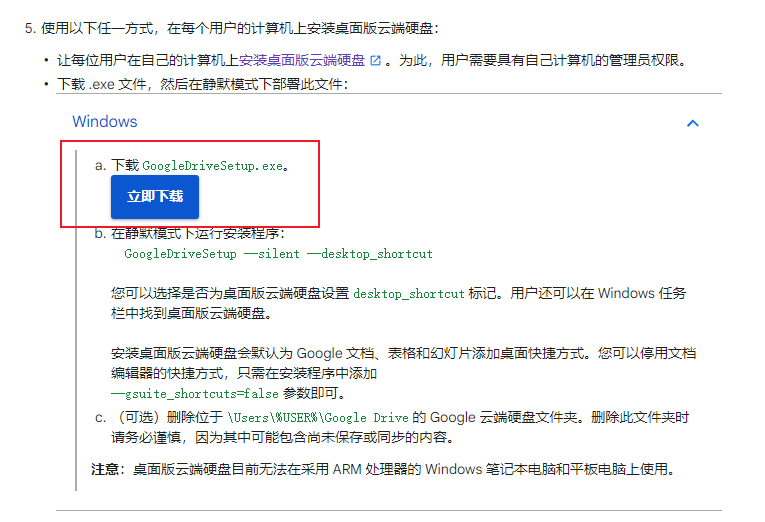
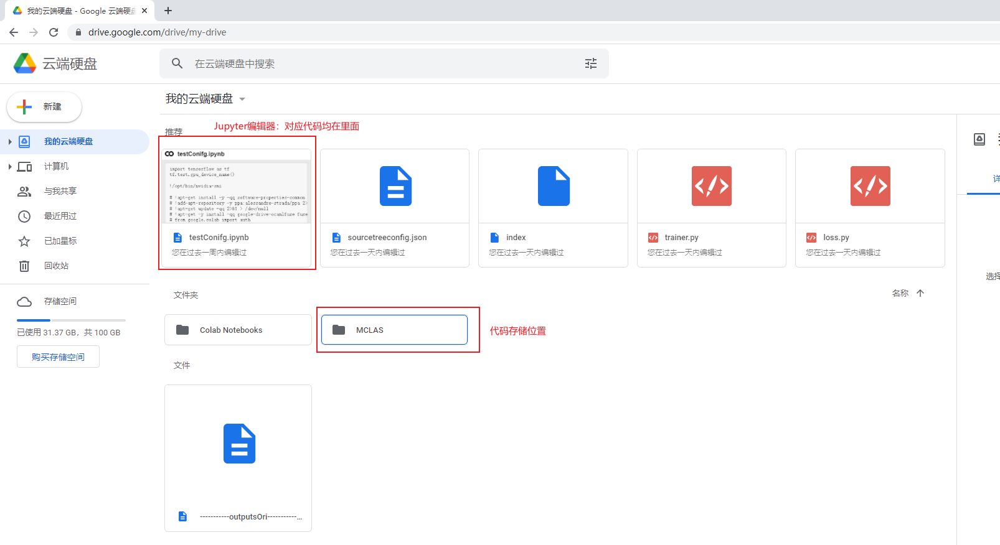
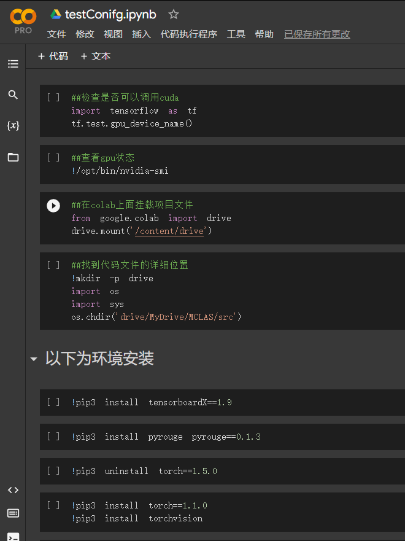
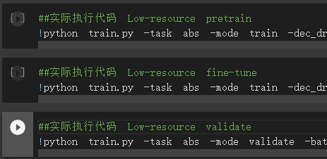
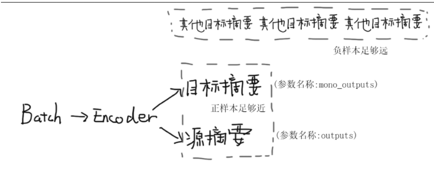
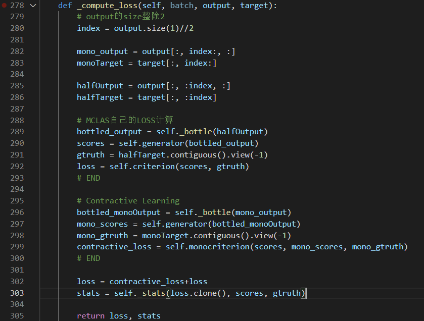
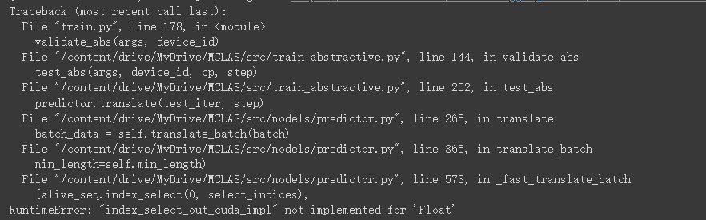

# MCLAS模型优化尝试--汪浩博
#### 摘要：

​    时间：20220425
​    平台：colab
​    优化内容：models/loss.js
​    优化逻辑：将mclas原有的loss和simcse模型的loss相加
​    碰到的问题：在validate这一步发现tensor存在问题：一方面tensor数值发现全为0，另一方面出现掩码时掩码tesnor的size和需要掩码的矩阵size不符

#### 详细介绍：

####  1.优化平台和代码配置：

​	代码均已经上传至colab，点击testConfig.ipynb,里面对应代码，按顺序点击以后即可运行。

​	以下为运行步骤

##### 	A.需要安装本地上传软件，同时登陆google drive

​		1.安装云盘上传软件：

​				https://support.google.com/a/answer/7491144?hl=zh-Hans#zippy=%2Cwindows

​				

​		2.谷歌账号&&密码： Jinxiang4405  &&  44054405zjx

##### B.页面如下：

进入testConfig.ipynb，则可以执行代码




**C.代码执行界面**

1.对应代码有什么用均写了注释，按顺序从上到下运行即可



2.最后三行为程序运行命令，使用的命令在下方MCLAS的文档里面

​	


### 2.代码优化逻辑：

当MCLAS模型的进行跨语言抽象摘要任务的时候，实现上先执行一次monolingual summarization(MS)任务，再执行一次 cross-lingual translation(CLS)任务。这意味着一份数据集，首先会成为源语言的摘要，再成为目标语言的摘要。

而对于对比学习来说，需要两个本质上相同的正样本对和其他负样本。通过loss计算，让两个正样本足够近，并让正负样本足够远。

结合的思路是将目标语言和源语言作为正样本对，正样本对离其他所有负样本(batch里的其他内容)足够远。

如图（同时表明了代码里对应的参数）：



##### A.数据查看

​	在训练中，mono_output和output均有数值的情况需要在命令行中添加参数：--multi_task(可以在下方MCLAS文档里找到)

​	（其中，mono_output，output数据可以在models/trainer.py 267行查看）

##### B.主要修改内容

​	models/loss.js 278行

​	在计算loss时候，output和mono_output会在trainer.py 274行通过cat方法在dim=1合并成一个tensor。由于这两个tensor的size一摸一样。因此我的思路是到了计算loss的方法里面，再把这个合并的tensor从dim=1对半切片。切片完成后一般进行MCLAS自己的LOSS计算，另一半进行对比学习的计算

​	

### 3.碰到的问题：

##### A.validate: tensor数据有误：

​	再算完loss之后打印tensor发现数值正常，但是在validate阶段输入模型时候发现tensor为一排0

​	(例如：tensor([0,0,0,0,0,0,0])）

**B.validate: tensormask不匹配**：



##### **C.torch版本难以降低：**

​	为了dubug生了一次torch版本（1.10.0），后面发现可以使用，但是每次希望安装模型torch版本时候（1.1.0）都会说不匹配然后强制安装1.10.0


# Multi-Task Framework for Cross-Lingual Abstractive Summarization (MCLAS)

The code for ACL2021 paper Cross-Lingual Abstractive Summarization with Limited Parallel Resources ([Paper](https://arxiv.org/abs/2105.13648)).

Some codes are borrowed from PreSumm (https://github.com/nlpyang/PreSumm).


## Environments

Python version: This code is in Python3.7

Package Requirements: torch==1.1.0, transformers, tensorboardX, multiprocess, pyrouge

Needs few changes to be compatible with torch 1.4.0~1.8.0, mainly tensor type (bool) bugs.


## Data Preparation
To improve training efficiency, we preprocessed concatenated dataset (with target "monolingual summary + [LSEP] + cross-lingual summary") and normal dataset (with target "cross-lingual summary") in advance.

You can build your own dataset or download our preprocessed dataset.
### Download Preprocessed dataset.
1. En2De dataset: [Google Drive Link](https://drive.google.com/file/d/17WTmAn5u1rQnd03r0zCUdXxYZfjf5uoa/view?usp=sharing).
2. En2EnDe (concatenated) dataset: [Google Drive Link](https://drive.google.com/file/d/13CK1RsbyafrS4tINRbVn5bZUA9CA5u7F/view?usp=sharing).
3. En2Zh dataset: [Google Drive Link](https://drive.google.com/file/d/1Gs_ieU_pMsE9BtLz0lO8qtmdnHHDCnU8/view?usp=sharing).
4. En2EnZh (concatenated) dataset: [Google Drive Link](https://drive.google.com/file/d/1Pc4JyXbzIOrhFIb5tpU9YyseNM-hb9cp/view?usp=sharing).

PS: Our implementation filter some invalid samples (if the target of a sample is too short). Hence the number of the training samples may be smaller than what is reported in the paper. 

### Build Your Own Dataset.
Remain to be origanized. Some of the code needs to be debug, plz use it carefully.
#### Build tokenized files.
Plz refer to function `tokenize_xgiga()` or `tokenize_new()` in `./src/data_builder.py` to write your code to preprocess your own training, validation, and test dataset. And then run the following commands:
```bash
python preprocess.py -mode tokenize_xgiga -raw_path PATH_TO_YOUR_RAW_DATA -save_path PATH_TO_YOUR_SAVE_PATH
```
* Stanford CoreNLP needs to be installed.

Plz substitute `tokenize_xgiga` to your own process function.

In our case, we made the raw data directory as follows:

```
.
└── raw_directory
    ├── train
    |   ├── 1.story
    |   ├── 2.story
    |   ├── 3.story
    |   └── ...
    ├── test
    |   ├── 1.story
    |   ├── 2.story
    |   ├── 3.story
    |   └── ...
    └─ dev
        ├── 1.story
        ├── 2.story
        ├── 3.story
        └── ...

```

Correspondingly, the tokenized data directory is as follows

```
.
└── raw_directory
    ├── train
    |   ├── 1.story.json
    |   ├── 2.story.json
    |   ├── 3.story.json
    |   └── ...
    ├── test
    |   ├── 1.story.json
    |   ├── 2.story.json
    |   ├── 3.story.json
    |   └── ...
    └─ dev
        ├── 1.story.json
        ├── 2.story.json
        ├── 3.story.json
        └── ...

```
#### Build tokenized files to json files.
```
python preprocess.py -mode format_to_lines_new -raw_path RAW_PATH -save_path JSON_PATH -n_cpus 1 -use_bert_basic_tokenizer false -map_path MAP_PATH -shard_size 3000
```
Shard size is pretty important and needs to be selected carefully. This implementation use a shard as a base data unit for low-resource training. 
In our setting, the shard size of En2Zh, Zh2En, and En2De is 1.5k, 5k, and 3k, respectively.

#### Build json files to pytorch(pt) files.
```
python preprocess.py -mode format_to_bert_new -raw_path JSON_PATH -save_path BERT_DATA_PATH  -lower -n_cpus 1 -log_file ../logs/preprocess.log
```


## Model Training
### Full dataset scenario training
To train our model in full dataset scenario, plz use following command. Change the data path to switch the trained model between NCLS and MCLAS. 

When using NCLS type datasets, arguement `--multi_task` enables training with NCLS+MS model.
```bash
 python train.py  \
 -task abs -mode train \
 -temp_dir ../tmp \
 -bert_data_path PATH_TO_DATA/ncls \  
 -dec_dropout 0.2  \
 -model_path ../model_abs_en2zh_noseg \
 -sep_optim true \
 -lr_bert 0.005 -lr_dec 0.2 \
 -save_checkpoint_steps 5000 \
 -batch_size 1300 \
 -train_steps 400000 \
 -report_every 50 -accum_count 5 \
 -use_bert_emb true -use_interval true \
 -warmup_steps_bert 20000 -warmup_steps_dec 10000 \
 -max_pos 512 -visible_gpus 0  -max_length 1000 -max_tgt_len 1000 \
 -log_file ../logs/abs_bert_en2zh  
 # --multi_task
```

### Low-resource scenario training
#### Monolingual summarization pretraining
First we should train a monolingual summarization model using following commands:

You can change the trained model type using the same methods mentioned above (change dataset or `--multi_task`)

```bash
python train.py  \
-task abs -mode train \
-dec_dropout 0.2  \
-model_path ../model_abs_en2en_de/ \
-bert_data_path PATH_TO_DATA/xgiga.en \
-temp_dir ../tmp \
-sep_optim true \
-lr_bert 0.002 -lr_dec 0.2 \
-save_checkpoint_steps 2000 \
-batch_size 210 \
-train_steps 200000 \
-report_every 50 -accum_count 5 \
-use_bert_emb true -use_interval true \
-warmup_steps_bert 25000 -warmup_steps_dec 15000 \
-max_pos 512 -visible_gpus 0,1,2 -max_length 1000 -max_tgt_len 1000 \
-log_file ../logs/abs_bert_mono_enen_de \
--train_first  

# -train_from is used as continue training from certain training checkpoints.
# example:
# -train_from ../model_abs_en2en_de/model_step_70000.pt \
```
#### Low-resource scenario fine-tuning
After obtaining the monolingual model, we use it to initialize the low-resource models and continue training process.

Note: 

`-train_from` should be omitted if you want to train a model without monolingual initialization.

`--new_optim` is necessary since we need to restart warm-up and learning rate decay during this process.

`--few_shot` controls whether to use limited resource to train the model. Meanwhile, '-few_shot_rate' controls the number of samples that you want to use. More specifically, the number of dataset's chunks.

For each scenario in our paper (using our preprocessed dataset), the few_shot_rate is set as 1, 5, and 10. 

```bash
python train.py  \
-task abs -mode train \
-dec_dropout 0.2  \
-model_path ../model_abs_enende_fewshot1/ \
-train_from ../model_abs_en2en_de/model_step_50000.pt \
-bert_data_path PATH_TO_YOUR_DATA/xgiga.en \
-temp_dir ../tmp \
-sep_optim true \
-lr_bert 0.002 -lr_dec 0.2 \
-save_checkpoint_steps 1000 \
-batch_size 270 \
-train_steps 10000 \
-report_every 50 -accum_count 5 \
-use_bert_emb true -use_interval true \
-warmup_steps_bert 25000 -warmup_steps_dec 15000 \
-max_pos 512 -visible_gpus 0,2,3 -max_length 1000 -max_tgt_len 1000 \
-log_file ../logs/abs_bert_enende_fewshot1 \
--few_shot -few_shot_rate 1 --new_optim
```


### Model Evaluation 
To evaluate a model, use a command as follows:
```bash
python train.py -task abs \
-mode validate \
-batch_size 5 \
-test_batch_size 5 \
-temp_dir ../tmp \
-bert_data_path PATH_TO_YOUR_DATA/xgiga.en \
-log_file ../results/val_abs_bert_enende_fewshot1_noinit \
-model_path ../model_abs_enende_fewshot1_noinit -sep_optim true \
-use_interval true -visible_gpus 1 \
-max_pos 512 -max_length 150 \
-alpha 0.95 -min_length 20 \
-max_tgt_len 1000 \
-result_path ../logs/abs_bert_enende_fewshot1 -test_all \
--predict_2language
```

If you are not evaluating a MCLAS model, plz remove `--predict_2language`.

If you are predicting Chinese summaries, plz add `--predict_chinese` to the command.

If you are evaluating a NCLS+MS model, plz add `--multi_task` to the command.

Using following two commands  will slightly improve all models' performance. 

`--language_limit` means that the predictor will only predict words appearing in summaries of training data.

`--tgt_mask` is a list, recording all the words appearing in summaries of the training set. We provided chiniese and english dict in ./src directory .


## Other Notable Commands
Plz ignore these arguments, these command were added and abandoned when trying new ideas¸
I will delete these related code in the future.
* `--sep_decoder`
* `--few_sep_decoder`
* `--tgt_seg`
* `--few_sep_decoder`
* `-bart`    


Besides, `--batch_verification` is used to debug, printing all the attributes in a training batch.


